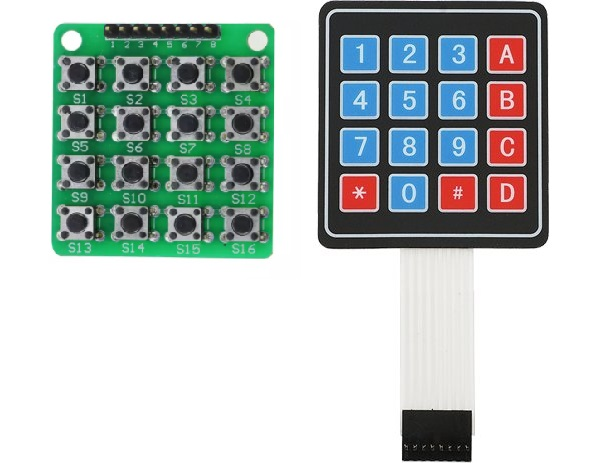
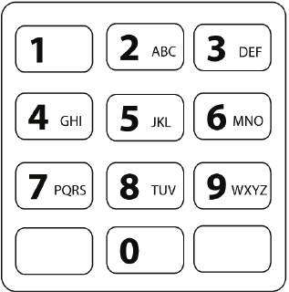
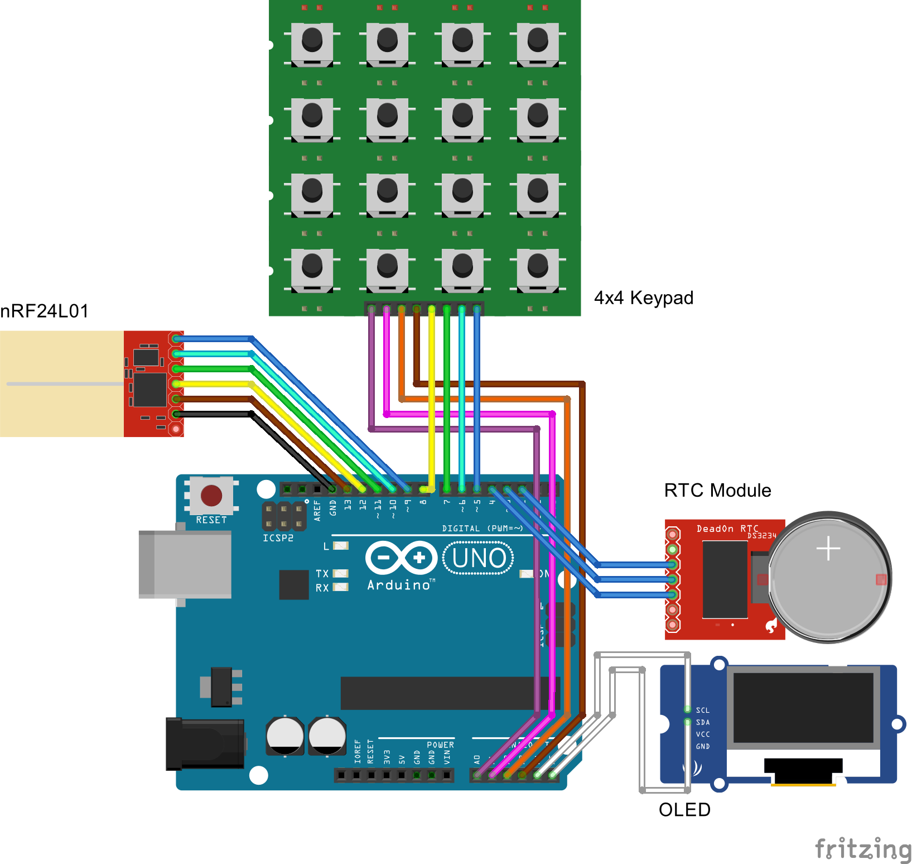

# 4x4 Alphanumeric Keypad - 4x4矩阵键盘字符输入法

Date: Dec 31, 2016

An alphanumeric input method on 4x4 keypads for Arduino. Stupid but works.

该程序展示了如何使用4x4矩阵键盘做到在两步之内输入92种字符。键盘可以是下图中的薄膜键盘或微动开关键盘，也适用于I2C键盘等。

It can input all 92 kinds of letters (lower and upper case), numbers and symbols within only 2 taps. Suitable for those who needs an input interface for his/her project but only has a small 4x4 keypad.

程序需要Arduino Keypad Library，由例程customKeypad修改得到。例程中推荐矩阵键盘接Arduino Uno的0-7引脚。应注意的是，这会占用Arduino的TX、RX引脚，进行串口通信的时候该引脚失效。

以下是可用的字符列表：
    
    0 1 2 3 4 5 6 7 8 9
    
    a b c d e f g h i j k l m n o p q r s t u v w x y z
    A B C D E F G H I J K L M N O P Q R S T U V W X Y Z
    
    
    @   $   %   !       (   )   \   /
    ^   &   ~   ?       [   ]   <   *
    :   ;   `   '       {   }   >   -
        #       "       .   _ space +

A sample project **Radio Freqency Text Transceiver (RFTT)** is supplemented to show how this input method can be used in your Arduino projects.

## Default Layout

|   |   |   |   |
| - | - | - | - |
| 1 | 2 | 3 | A |
| 4 | 5 | 6 | B |
| 7 | 8 | 9 | C |
| L | 0 | R | D |

**Alphanumeric Keys:**

For entering a number 0 - 9, tap the corresponding key twice.

> Example:  
> '2' + '2' → 2

For entering a letter in lower case, tap the corresponding number, and tap A - D to select the letter. After selecting a number, function keys A - D becomes 1 - 4 for you to choose from the letters. The mapping follows the standard 12 key telephone keypad.

> Example:  
> '3' + 'B' → e

For entering a letter in upper case, first tap function key B (Caps Lock), then do the same thing as above.

> Example:  
> 'B' + '3' + 'B' → E

**Function Keys:**

| Function Key | Function | Description |
| ------------ | -------- | ----------- |
| A | **Backsapce** | delete last symbol |
| B | **Caps Lock** | switch the case |
| C | **Time Setting** | time settings, used in **RFTT**. can define your own |
| D | **Send** | send button, used in **RFTT**. can define your own |
| L | **Symbol Layout 1** | change to symbol layout 1. see below |
| R | **Symbol Layout 2** | change to symbol layout 2. see below |

## Symbol Layout 1

|   |   |   |   |
| - | - | - | - |
| @ | $ | % | ! |
| ^ | & | ~ | ? |
| : | ; | ` | ' |
|   | # |   | " |

We can enter the symbol layout 1 after 'L' is pressed. If any symbol is pressed, the symbol is keyed in and we then go back to the default layout.

> Example:  
> 'L' + 'B' → ?  
> 'L' + '0' → #

## Symbol Layout 2

|   |   |   |   |
| - | - | - | - |
| ( | ) | \ | / |
| [ | ] | < | * |
| { | } | > | - |
| . | _ | space | + |

In symbol layout 2 we can type in the space and dot right next to the key '0'.

> Example:  
> 'R' + 'B' → *  
> 'R' + '0' → _

## Radio Freqency Text Transceiver - 射频聊天器

项目来自2016通信科协练习赛赛题。两个设备间使用nRF24L01射频模块实现字符串的收发和存储。项目使用EEPROM保存聊天记录，并在OLED上录入和显示消息。

由于要显示两个设备的聊天信息流，我们需要给消息加上时间戳。然而只有其中一个设备有RTC不掉电时钟模块，因此两个终端的行为不是对称的。有RTC的设备发消息时需要带上发送消息的时间，没有RTC的设备发消息时没有时间戳，此时另一端需要把时间戳返回过来。有RTC的一端还需要有设定时间的功能。

因此代码也分为有RTC的RFTT_RTC.ino和没有RTC的RFTT.ino。它们唯一的另一个区别是nRF24L01的TX、RX设置是相反的。

**Wiring Arrangement:**

|   nRF24L01  |      RTC     |     OLED     |    Keypad    |
| ----------- | ------------ | ------------ | ------------ |
|   CE = D9   |    CE = D4   |   SCL = A?   | ROWS A0,A1,A2,A3 |
|  CSN = D10  |    IO = D3   |   SDA = A?   | COLS D8,D7,D6,D5 |
| MOSI = D11  |  SCLK = D2   |              |              |
| MISO = D12  |              |              |              |
|  SCK = D13  |              |              |              |
|  IRQ = NC   |              |              |              |

**No Longer Maintenance:**

The project is only for reference. It is not guaranteed for flawless compilation.